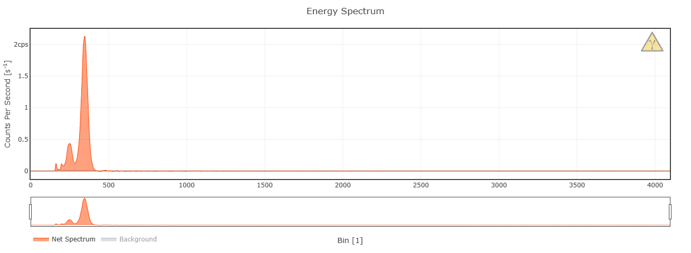
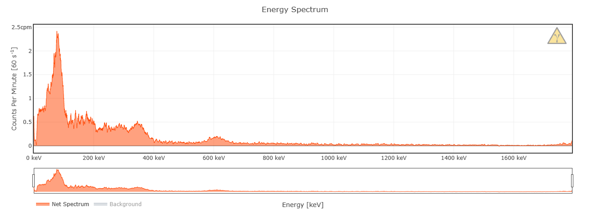
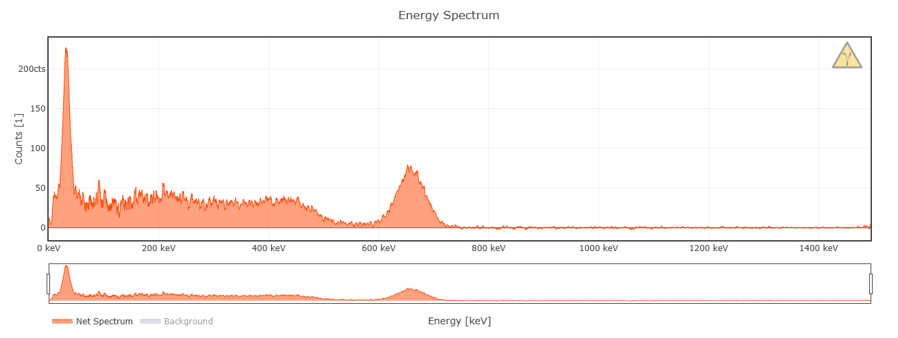

# Open Gamma Detector

**IMPORTANT, PLEASE READ:** I am currently in the midst of updating everything to the brand-new revision 4.0. This will take a few weeks for each and everything to be up-to-date. In the mean time there is a [log on Hackaday](https://hackaday.io/project/185211-all-in-one-gamma-ray-spectrometer/log/225597-revision-40-status-report) about the latest status of the project. Please be patient, thanks ;)

The hardware files are already here and the software works. However, there will still be some changes to the final software and all the documentation will be slowly updated.

---

**This is the latest hardware revision 4.0. For older revisions, please have a look at the [other branches](https://github.com/OpenGammaProject/Open-Gamma-Detector/branches). A comparison between the 4.0 and 3.x hardware can be found [here](https://hackaday.io/project/185211-all-in-one-gamma-ray-spectrometer/log/225597-revision-40-status-report).**

**This project is also on [Hackaday.io](https://hackaday.io/project/185211-all-in-one-gamma-ray-spectrometer), where I post important project updates and other announcements!**

Open hardware for a hackable scintillation counter and multichannel analyzer (MCA) all-in-one device using a popular NaI(Tl) scintillation crystal and a silicon photomultiplier (SiPM). Extremely affordable design for a DIY gamma spectroscopy setup with a total parts cost of under around 200 USD.

The detector uses a standard serial-over-USB connection so that it can be integrated into as many other projects as possible, for example data logging with a Raspberry Pi, weather stations, Arduino projects, etc.

  
   
  

If you want a barebone version of the Open Gamma Detector to count pulses or something like that, you can have a look at the [Mini SiPM Driver](https://github.com/OpenGammaProject/Mini-SiD) board.

## Features

Here are some of the most important specs:

- Compact design: Total size 120 x 50 mm. Approx. 70 x 50 mm area for electronics and additional 50 x 50 mm to mount a scintillator.
- All-in-one: No external parts (e.g. sound card) required to record gamma spectra.
- Easily programmable using drag-and-drop firmware files or the standard Arduino IDE.
- Low-voltage device: No HV needed like with photomultiplier tubes.
- Can use SiPMs in the voltage range of 27.5 V to 33.8 V.
- 4096 ADC channels with built-in 3 V voltage reference.
- Energy resolution of ~8% @ 662 keV possible; highly dependent on your SiPM/scintillator assembly.
- Energy Mode: About 15 µs total dead time while measuring energy minimum.
- Geiger Mode: About 5 µs total dead time without energy measurements minimum.
- Low power consumption: ~20 mA @ 5 V with default firmware at normal background.
- Built-in ticker (buzzer) for audible pulse count rate output.
- Additional broken-out power pins and I2C, SPI and UART headers for custom parts (e.g. display, µSD card, etc.).
- Simple OLED support out of the box (SSD1306 and SH110x).
- Built-in True Random Number Generator.

## How To Get One

- For quick access and purchase of all the parts (PCB and BOM), you can use [Kitspace](https://kitspace.org/boards/github.com/opengammaproject/open-gamma-detector/). Otherwise, use a PCB manufacturer and an electronics distributor of your choice and proceed on your own.

- The fully assembled main detector board can be purchased on my [Tindie store](https://www.tindie.com/products/28827/). With your purchase your are also supporting me in my efforts to maintain and improve this project, thanks!

**In both cases you will also need to buy a SiPM (e.g. the MICROFC-60035-SMT-TR) and scintillator (NaI(Tl) recommended) separately at a distributor of your choice.** You might also want to grab one of the countless SiPM breakout boards I made.

## Working Principle

Here is a nice flow chart to describe how the device roughly works:

## Hardware

Hardware design has been done with [EasyEDA](https://easyeda.com/) and all the needed files for you to import the project as well as the schematic can be found in the `hardware` folder. There is also a Gerber file available for you to go directly to the PCB manufacturing step.

Detailed information about the hardware of the detector as well as the potentiometer settings and assembly can be found in the [hardware directory](/hardware/).

## Software

The software aims to be as simple as possible to understand and maintain. To achieve this I decided to use an off-the-shelf microcontroller - the [Raspberry Pi Pico](https://www.raspberrypi.com/products/raspberry-pi-pico/). This board can be programmed with the Arduino IDE over micro-USB and is powerful (dual core, fast ADC, plenty of memory, ...) enough for the purpose and also exceptionally cheap.

To program the Pico and/or play around with the firmware, head to the [software directory](/software/). There you will also find documentation on the serial interface (!), display support, and much more.

## Example Spectra

Here is a small collection of example spectra I could make quickly without putting much effort into the detector settings (threshold, SiPM voltage, software tweaks). I'm using the [Tiny MicroFC Breakout](https://github.com/OpenGammaProject/Tiny-MicroFC-Carrier-Board) and just a single SiPM (which isn't the optimal setup actually). In addition, neither the electronics nor the scintillator and sample were shielded from EMI or background radiation whatsoever. So as you can see the detector is actually pretty robust in that regard.

4 hour long background spectrum with no samples:

30 minute spectrum of two tiny (~5 g) LYSO scintillator showing two distinct gamma peaks (201.83, 306.78 keV) with an additional ~55 keV X-ray peak. The 307 keV peak has ~13.5% energy resolution in this case:

5 minute spectrum of Am-241 commonly used in household ionization smoke detectors (e.g. in the US, they're no longer allowed in the EU). Gamma peaks at 26.34 and 59.54 keV:

30 minute spectrum of a small tea cup with pure Uraninite (also known as pitchblende) contents in its glaze. You can see all kinds of isotopes of the Uranium series including the Bi-214 peak at ~610 keV:

Spectrum of a Na-22 test source, about ~2 µCi made with a Rev.2 board (worse energy resolution than the latest version). You can see the 511 keV annihilation peak and the small 1275 keV gamma peak (much smaller due to limited NaI efficiency and small scintillator size for this energy) as well as the compton edge and continuum:

4 hour long spectrum of about 100 grams of mushrooms still containing the isotope Cs-137 from the Chernobyl disaster. You can clearly see the gamma peak at 662 keV and the ~32 keV X-ray peak:

## Known Limitations

1. The Raspberry Pi Pico's ADC has some pretty [severe DNL issues](https://pico-adc.markomo.me/INL-DNL/#dnl) that result in four channels being much more sensitive (wider input range) than the rest. For now the simplest solution was to discard all four of them, by printing a `0` when any of them comes up in the measurement (to not affect the cps readings). You can turn this behavior off by using the `set correction` command. This is by no means perfect or ideal, but it works for now until this gets fixed in a later hardware revision of the RP2040 (wish us luck!).

2. Due to parts shortages some chips might be much harder to come by, if at all that is. Parts that are listed in the BOM should be available easily and with high reliability and stock so that they don't run out quickly. Please let me know if you cannot find a part anymore.

3. The power supply is **not** temperature corrected itself, meaning changes in the ambient temperature with a constant voltage affect the gain of the SiPM. This will naturally result in a different DC bias, energy range and S/N ratio. This effect is negligible around room temperature, though. The temperature dependence of the gain is -0.8%/°C (21°C) for the MicroFC SiPMs. **The latest [MicroFC SiPM carrier board](https://github.com/OpenGammaProject/MicroFC-SiPM-Carrier-Board) has automatic temperature compensation on-board however! So use that if you want to get the best performance out of it.**

## Troubleshooting and FAQ

Please have a look at [REFERENCE.md](REFERENCE.md) for some general guidance.

If this doesn't help you, feel free to reach out and create an issue or open a discussions thread.

## Some Ideas

### Coincidence Measurements

Using multiple detector boards with some firmware modifications it should be theoretically possible to implement a coincidence measurement feature. By respectively connecting the `VSYS`, `GND` and one of the broken-out pins to each other on both boards you have everything you need to get started. The pins would be used for an interrupt from the child detector to the parent to trigger a pulse if both timings coincide.

At the moment, though, I couldn't get a coincidence mode feature running due to some weird timing issues. There might be a firmware update in the future to implement this feature. If you have any ideas, let me know!

### Cooling the SiPM

During operation all the electronics including the SiPM naturally heat up ever so slightly. Due to the detector board (where most of the power is dissipated) not being directly connected to the SiPM self-heating is negligible, though. Therefore air or water cooling alone won't improve performance considerably, because it won't heat up much above ambient temps, if at all that is. However, you could cool the SiPM PCB with a Peltier module to sub-ambient temperatures. According to the [datasheet AND9770 (Figure 27)](https://www.onsemi.com/pub/Collateral/AND9770-D.PDF) every 10°C reduction in temperature decreases the dark count rate by 50%! But be sure to correct the SiPM voltage (overvoltage) in this case as it also changes with temperature.

Note that the required breakdown voltage of the SiPM increases linearly with 21.5 mV/°C, see the [C-Series SiPM Sensors Datasheet](https://www.onsemi.com/pdf/datasheet/microc-series-d.pdf). This means that you would also need to temperature correct the PSU voltage if you wanted to use it with considerably different temperatures.

### Shielding Background Radiation

Shielding the ambient background can be done ideally using a wide enough layer of lead (bricks) all around the detector with a thin layer of lower-Z material on the inside such as copper to avoid backscattering. The SiPM and the sample can then be put into the structure to get the best measurements possible (low background).

See Wikipedia: [Lead Castle](https://en.wikipedia.org/w/index.php?title=Lead_castle&oldid=991799816)

---

Thanks for reading.
